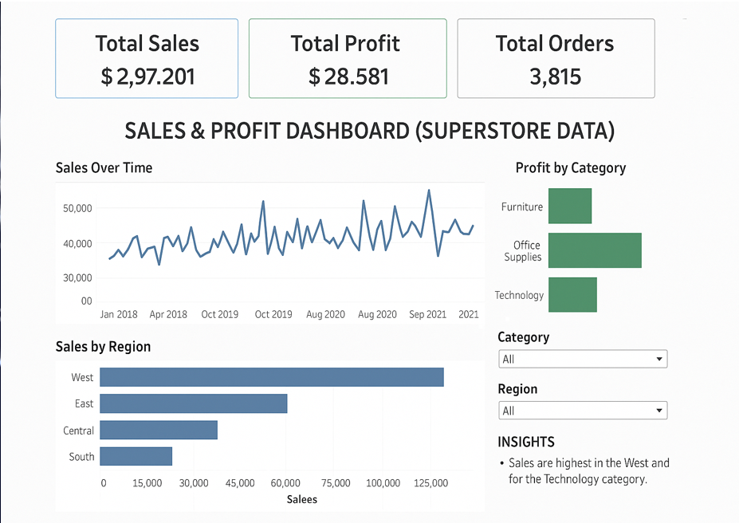

# 📊 Sales & Profit Dashboard

This repository contains a professional Tableau dashboard and supporting presentation created during my internship.  
The dashboard helps business stakeholders analyze **Sales Trends, Profit Performance, and Regional/Category Comparisons**.

---

## 📌 Task Objective
Design an interactive and user-friendly dashboard to explore:
- Sales growth over time
- Profit margin analysis
- Category and regional comparisons
- Key performance indicators (KPIs)

---

## 🎯 Key Features
- 📌 KPI Cards: Total Sales, Total Profit, Total Orders  
- 📈 Time-series analysis with line charts  
- 🌍 Regional and category-wise breakdown  
- 🎛️ Filters for interactivity  
- 🎨 Consistent color theme and clean layout  
- 📝 Insights derived from data analytics  

---

## 🛠️ Tools Used
- Tableau → Dashboard design & visualization  
- Excel → Data cleaning & preparation  
- PowerPoint → Final presentation summary  

---

## 🖼️ Dashboard Preview

---

## 📘 Learning Outcomes
Through this task, I learned to:
- Select and visualize relevant KPIs
- Design professional, user-friendly dashboards
- Translate data into business insights

---

## 🔍 Insights
- The [Region] region generated the highest overall sales.  
- [Category] contributed the maximum profit share (~30%).  
- Profitability was inconsistent across [Sub-categories].  

---

## 📂 Included Files
- `Final_Sales_Profit_Dashboard_PPT.pptx` → Presentation with objectives & insights  
- `dashboard_preview.png` → Dashboard snapshot  

---

## 📅 Project Info
- Created by: **Debabrata Mondal**  
- Task Date: **05 June 2025**  
- Dataset: Superstore Sample Dataset (Tableau)  

---
